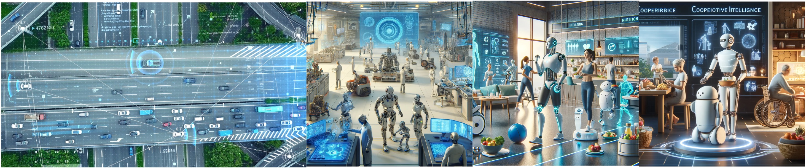

---
# Feel free to add content and custom Front Matter to this file.
# To modify the layout, see https://jekyllrb.com/docs/themes/#overriding-theme-defaults

permalink: /
title: "1st Workshop on Cooperative Intelligence for Embodied AI"
list_title: Home
layout: home
---

<a href="https://eccv2024.ecva.net/">The 18th European Conference on Computer Vision 2024 in Milan, Italy</a>

September 30th, 2024

<!-- 
Location: Sequoia 1
 -->
<!-- 
[<a href="">Youtube</a>] [<a href="https://discord.gg/yqjTtBmUJC">Discord</a>] [<a href="https://openreview.net/group?id=IEEE.org/2024/ICRA/Workshop/WIHR">OpenReview</a>]
 -->
<!-- 
Recording available at: <a href="">Youtube</a>
 -->

This workshop focuses on cooperative intelligence within multi-agent autonomous systems. The first session will primarily discuss "**Multi-Agent Autonomous Systems Meet Foundation Models: Challenges and Futures**".

The progress in artificial intelligence has propelled the development of Embodied AI, particularly in autonomous driving and robotics. However, achieving autonomy in complex and open environments remains challenging for individual agents. This is where cooperative intelligence comes in, a paradigm where agents collaborate and interact with infrastructure equipment to handle diverse tasks effectively. In autonomous driving, the availability of datasets and breakthrough algorithms has spurred research interest in cooperative autonomous driving. Through Vehicle-to-Everything (V2X) interactions including Vehicleto-to-Vehicle (V2V) and Vehicle-to-Infrastructure (V2I), autonomous vehicles can improve their perception and safety capabilities, surpassing the limitations of single-vehicle autonomy and paving the way for widespread adoption. Similarly, in robotics, recent advancements in multi-agent systems offer a cost-effective solution for exploring unknown environments. These breakthroughs empower robots to assist humans in navigating challenging tasks within open environments. Despite notable progress, the challenges of coordinating multi-agent systems remain insufficiently explored. Issues like determining what information to transmit, how to transmit it, and how to fuse information across different task levels (perception, prediction, planning, etc.) pose practical deployment hurdles. Recent breakthroughs in large language models and foundational models offer a promising avenue for addressing these challenges. This workshop, complementing existing workshops focused on individual intelligence in autonomous driving and robotics, introduces a fresh perspective. It fosters discussions on a comprehensive, system-level approach to cooperative framework design for autonomous agents across diverse domains.

Specifically, this workshop aims to address the following issues regarding cooperative intelligence:
- **The value and prospects** of cooperative intelligence for autonomous driving and robotics.
- **The challenges and recent advancements** in cooperative intelligence for multi-agent autonomous systems.
- **The foundation models** for multi-agent autonomous systems.

&nbsp;
&nbsp;

### Call for papers

**Submission Topics**

We invite submissions including but not limited to the following topics:

- Vehicle-to-Vehicle (V2V) and Vehicle-to-Infrastructure (V2I)
- Multi-agent Robotic System / Swarm Robots
- Communication-Efficient Cooperative Perception
- Cooperative Motion Prediction and Decision-Making
- End-to-End Cooperative Policy Learning
- Efficient and Intelligent V2X Communication
- Data Security and Privacy in Multi-agent Communication
- Multi-Robot Exploration and Mapping
- Intelligent Transportation System
- Large Language Model (LLM)-assisted Cooperative System
- Foundation models for Cooperative System
- Datasets and Benchmarks for Cooperative Learning

**Important Dates**
- **Paper submission open**: June 1st, 2024

- **Paper submission deadline**: July 25th, 2024 (PST)

- **Notification of acceptance**: August 8th, 2024

- **Camera ready**: August 15th, 2024 (PST)

- **Workshop date**: PM of Sep 30th, 2024 (See [ECCV Workshop Lists](https://eccv2024.ecva.net/Conferences/2024/Workshops))

**Submission Guidance**
- **Submission portal**: [ECCV 2024 Workshop Co-Intelligence (OpenReview)](https://openreview.net/group?id=thecvf.com/ECCV/2024/Workshop/MAAS).

- **Submission format**:
Submissions must follow the ECCV 2024 template ([here](https://eccv2024.ecva.net/Conferences/2024/SubmissionPolicies)) and will be peer-reviewed in a double-blind manner. Submission must be no more than 14 pages (excluding references). By default, accepted papers will be included in the ECCV workshop proceedings. Accepted papers will be presented in the form of posters, with several papers being selected for spotlight sessions.

**Important Notes**

The accepted papers will be featured in the proceedings, in a separate volume. The <b>Best Paper Award</b> and <b>Best Paper Nomination</b> will receive a cash prize of <b>500 US dollars</b> and <b>300 US dollars</b>, respectively.

**Contact**

If you have any questions, please contact us at: coop-intelligence@googlegroups.com or yuhaibao94@gmail.com.

&nbsp;
&nbsp;
### Invited Speakers (TBD)
&nbsp;

    

        <figure>
        
        <figcaption><b><a href="https://mobility-lab.seas.ucla.edu/about/">Jiaqi Ma</a></b> UCLA, USA</figcaption>
        </figure>
    

    

        <figure>
         
        <figcaption><b><a href="https://www.professoren.tum.de/en/knoll-alois-christian/">Alois C. Knoll</a></b> TUM, Germany</figcaption>
        </figure>
    

    

        <figure>
        
        <figcaption><b><a href="https://hangqiu.github.io/">Hang Qiu</a></b> University of California, Riverside, USA</figcaption>
        </figure>
    

    

        <figure>
        
        <figcaption><b><a href="https://cde.nus.edu.sg/me/staff/sartoretti-guillaume-a/">Guillaume Sartoretti</a></b> NUS, Singapore</figcaption>
        </figure>
    

    

        <figure>
        
        <figcaption><b><a href="http://network.ee.tsinghua.edu.cn/shengzhou/">Sheng Zhou
</a></b> Tsinghua University, China</figcaption>
        </figure>
    

    

        <figure>
        
        <figcaption><b><a href="https://www.cst.cam.ac.uk/people/asp45">Amanda Prorok</a></b> Cambridge University, UK</figcaption>
        </figure>
    

    

        <figure>
        
        <figcaption><b><a href="https://faculty.cc.gatech.edu/~zk15/">Zsolt Kira</a></b> Gatech, USA</figcaption>
        </figure>
    

    

        <figure>
        
        <figcaption><b><a href="https://tlab.hongo.wide.ad.jp/People/manabu-tsukada/">Manabu Tsukada</a></b> The University of Tokyo, Japan</figcaption>
        </figure>
    

    

        <figure>
        
        <figcaption><b><a href="https://web.stanford.edu/~pavone/">Marco Pavone</a></b> Standford University, USA</figcaption>
        </figure>
    

    

        <figure>
        
        <figcaption><b><a href="https://jingweij.github.io/">Jingwei Ji</a></b> Waymo, USA</figcaption>
        </figure>
    

&nbsp;

### Organizers
&nbsp;

    

        <figure>
        
        <figcaption><b><a href="https://www.linkedin.com/in/haibao-yu-152221118">Haibao Yu</a></b> University of Hong Kong & Tsinghua University</figcaption>
        </figure>
    

    

        <figure>
         
        <figcaption><b><a href="https://www.linkedin.com/in/jianing-qiu-91a802224/">Jianing Qiu</a></b> CUHK</figcaption>
        </figure>
    

    

        <figure>
        
        <figcaption><b><a href="http://web.stanford.edu/~jksun/">Jiankai Sun</a></b> Stanford University</figcaption>
        </figure>
    

    

        <figure>
        
        <figcaption><b><a href="https://scholar.google.com/citations?hl=en&user=ulZxvY0AAAAJ">Li Chen</a></b> Shanghai AI Lab</figcaption>
        </figure>
    

    

        <figure>
        
        <figcaption><b><a href="https://walzimmer.github.io/website/">Walter Zimmer</a></b> Technical University of Munich</figcaption>
        </figure>
    

    

        <figure>
        
        <figcaption><b><a href="https://web.stanford.edu/~schwager/">Mac Schwager</a></b> Stanford University</figcaption>
        </figure>
    

    

        <figure>
        
        <figcaption><b><a href="http://luoping.me/">Ping Luo</a></b> University of Hong Kong</figcaption>
        </figure>
    

    

        <figure>
        
        <figcaption><b><a href="https://scholar.google.com/citations?user=yveq40QAAAAJ&hl=en">Ruigang Yang</a></b> Inceptio Technology</figcaption>
        </figure>
    

    

        <figure>
        
        <figcaption><b><a href="https://colalab.net/">Si Liu</a></b> Beihang University</figcaption>
        </figure>
    

    

        <figure>
        
        <figcaption><b><a href="https://air.tsinghua.edu.cn/en/info/1046/1192.htm">Zaiqing Nie</a></b> Tsinghua University</figcaption>
        </figure>
    

### Program Committee
&nbsp;

    

        

&#8226;&nbsp;<a href="">Jiaru Zhong</a> (BIT)

        

&#8226;&nbsp;<a href="">Zhenwei Yang</a> (USTB)

        

&#8226;&nbsp;<a href="https://sites.google.com/site/yangliuveronica/">Yang Liu</a> (Tsinghua University)

        

&#8226;&nbsp;<a href="https://xieenze.github.io/">Enze Xie</a> (HKU)

        

&#8226;&nbsp;<a href="https://scholar.google.com/citations?user=KlHuj2QAAAAJ&hl">Yifeng Shi</a> (Baidu)

        

&#8226;&nbsp;<a href="https://scholar.google.com/citations?user=1H5PwZkAAAAJ&hl">Weitao Zhou</a> (Tsinghua University)

        

&#8226;&nbsp;<a href="https://phyllish.github.io/">Yue Hu</a> (SJTU)

    

    

        

&#8226;&nbsp;<a href="https://ry-hao.top/">Ruiyang Hao</a> (Tsinghua University)

        

&#8226;&nbsp;<a href="">Siqi Fan</a> (Tsinghua University)

        

&#8226;&nbsp;<a href="https://yanwang202199.github.io/">Yan Wang</a> (Tsinghua University)

        

&#8226;&nbsp;<a href="https://scholar.google.com/citations?user=3qK1cZMAAAAJ&hl">Tuopu Wen</a> (Tsinghua University)

        

&#8226;&nbsp;<a href="https://yaomarkmu.github.io/">Yao Mu</a> (HKU)

        

&#8226;&nbsp;<a href="https://dingmyu.github.io/">Mingyu Ding</a> (UC Berkeley)

        

&#8226;&nbsp;<a href="https://ieeexplore.ieee.org/author/37086579788">Lipeng Chen</a> (Tencent Robotics X)

    

    

        

&#8226;&nbsp;<a href="">Wenxian Yang</a> (Tsinghua University)

        

&#8226;&nbsp;<a href="https://yuexinma.me/">Yuexin Ma</a> (ShanghaiTech University)

        

&#8226;&nbsp;<a href="https://sites.google.com/view/guangliangcheng">Guangliang Cheng</a> (UOL)

        

&#8226;&nbsp;<a href="https://rruisong.github.io">Rui Song</a> (TUM)

        

&#8226;&nbsp;<a href="https://air.tsinghua.edu.cn/en/info/1012/1219.htm">Jirui Yuan</a> (Tsinghua University)

        

&#8226;&nbsp;<a href="https://shijianping.me/">Jianping Shi</a> (SenseTime)

        

&#8226;&nbsp;<a href="https://jiachenli94.github.io/">Jiachen Li</a> (UC River)

    

### Sponsors (TBD)
&nbsp;